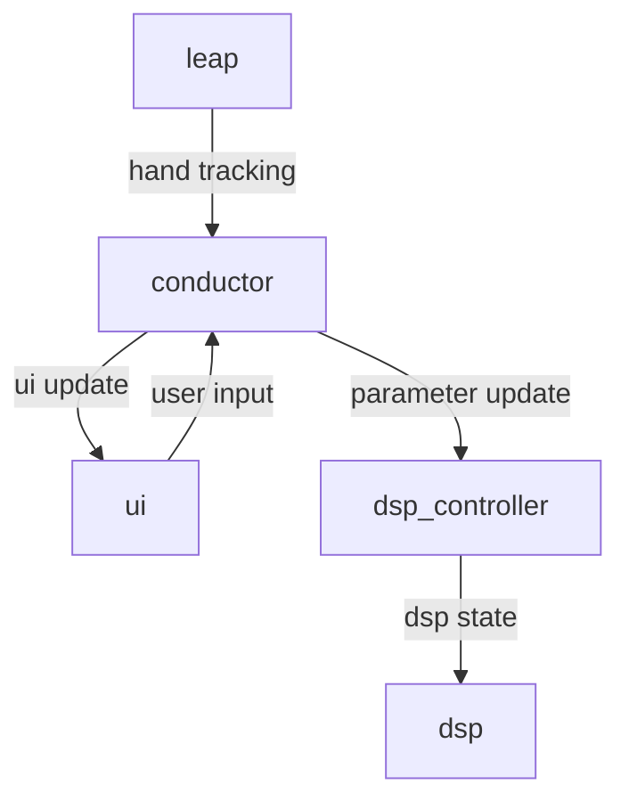

# Theremotion

👐 Theremotion is a virtual instrument inspired by the Theremin.

Just like a Theremin, the position of your hand in the air controls the pitch
and volume of the sound. However, you can also control much more dimensions of
the sound with specific motions.

With specific hand positions, you can control a low pass filter, a supersaw
sound, a guitar sound and more. You can even make the instrument "stick" to a
scale, making it much easier to control than a Theremin.

## Instructions

Head over to the [Theremotion website](https://plule.github.io/theremotion/) for
instructions on usage and installation.

## Tools

 ) 

The hand tracking is provided by Ultraleap's [Leap Motion Controller](https://www.ultraleap.com/product/leap-motion-controller/).

The sound generation is created with Grame's [Faust](https://faust.grame.fr/).

The UI is built with [Slint](https://slint.dev).

The program is built with [Rust](https://www.rust-lang.org).

## Development

In order to build Theremotion, you need to install
[Rust](https://www.rust-lang.org) and [Ultraleap's tracking
software](https://developer.leapmotion.com/tracking-software-download). If you
wish to modify the sound generation, you also need to install
[Faust](https://faust.grame.fr/).

Build with `cargo build`. When modifying the DSP, set the environment variable
`THEREMOTION_REGEN_DSP` to any value in order to regenerate the DSP code when
running `cargo build`.

If using the Orion version of Ultraleap, build with `cargo build
--no-default-features`.

If the tracking software is installed at a custom path, set the environment
variable `LEAPSDK_LIB_PATH` to the absolute path of the
`Ultraleap/LeapSDK/lib/x64` before running the build.

### Linux

Building on Linux requires to install some development libraries including:

- `libasound2-dev`

### Crates

The source code is divided into 3 crates:

- **theremotion** is the main crate
- **theremotion-dsp** contains the DSP producing the audio, generated with Faust
- **theremotion-ui** contains the user interface, generated with Slint

### Architecture

Theremotion is run by 4 main threads:

- `conductor` receives the updates from all the other threads and transmits
  them. It contains all the movement definitions and holds the settings
- `leap` provides the hand tracking messages
- `dsp_controller` manages reads the parameter messages and manages the DSP state
- `dsp` produces the sounds based on the DSP state
- `ui` is the main thread and provides the user interface

## License

With the exception of any third-parties (such as the Rust, Faust and Ultraleap
logos, the Ultraleap redistributables, the Noto Emoji fonts), Theremotion is
distributed under the GPLv3 license. Its DSP ("theremotion-dsp") is distributed
under the BSD license.
