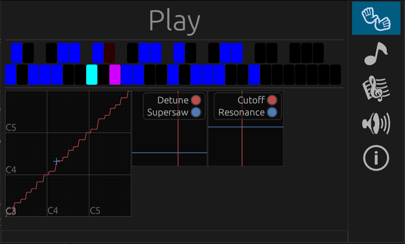

# Theremotion

👐 Theremotion is a virtual instrument inspired by the Theremin.

Just like a Theremin, the position of your hand in the air controls the pitch
and volume of the sound. However, you can also control much more dimensions of
the sound with specific motions.

With specific hand positions, you can control a low pass filter, a supersaw
sound, a guitar sound and more. You can even make the instrument "stick" to a
scale, making it much easier to control than a Theremin.

<iframe width="560" height="315" src="https://www.youtube.com/embed/GGALeKm_uzc" title="YouTube video player" frameborder="0" allow="accelerometer; autoplay; clipboard-write; encrypted-media; gyroscope; picture-in-picture" allowfullscreen></iframe>

## Features

- 👐 Theremotion is a synthesizer controlled by your hands.
- 👈 Move up left hand to control the volume.
- 👉 Move your right hand horizontally closer or further away from a virtual antenna to control the pitch.
- 👋 Move your left hand on the horizontal plane to control the filter.
- 👋 Move up your right hand to play a chord.
- 👌 Pinch with your right hand to snap to a scale.
- 🎸 Pinch with your left hand, and rotate it to play guitar.

A left handed mode is also included.

## Installation

In order to play with Theremotion you need a [Leap Motion
Controller](https://www.ultraleap.com/product/leap-motion-controller/) and a
compatible Windows PC.

First of all, install the Gemini version of [Ultraleap's tracking
software](https://developer.leapmotion.com/tracking-software-download).

Lastly, download and install Theremotion from the link at the top of the page.
For alternative downloads, refer to the [latest release
page](https://github.com/plule/theremotion/releases/latest/).

## Tools

 ) 

The hand tracking is provided by Ultraleap's [Leap Motion Controller](https://www.ultraleap.com/product/leap-motion-controller/).

The sound generation is created with Grame's [Faust](https://faust.grame.fr/).

The program is built with [Rust](https://www.rust-lang.org).
